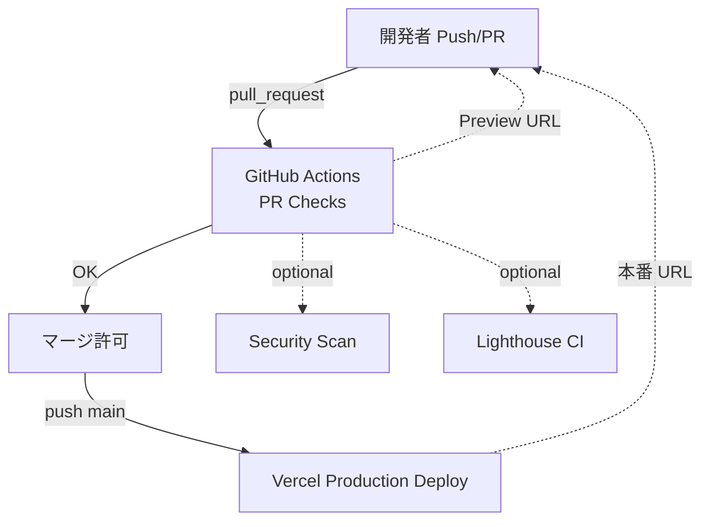

# Next.js × Vercel 無料 CI/CD ガイド

## 0. 目的
GitHub 上の Next.js プロジェクトを **無料プラン**のまま  
- PR 作成時に *AI コードレビュー* を実行  
- `main` ブランチへのマージを保護  
- マージ成功時に Vercel Production へ自動デプロイ  
- （任意）セキュリティスキャン・UX 測定を追加  

というパイプラインで運用する設計指針をまとめます。  
前提知識ゼロでも **クリック操作 + YAML コピペ** だけで導入できます。

---

## 1. システム構成図



---

## 2. リポジトリ構造

```
your-repo/
├─ .github/
│  └─ workflows/
│     ├─ pr.yml   # AI レビュー
│     └─ sec.yml  # (任意) セキュリティスキャン
└─ nextjs app...
```

---

## 3. YAML テンプレート

### 3.1 PR 用 (`.github/workflows/pr.yml`)

```yaml
name: PR Checks
on: [pull_request]

jobs:
  ai-review:
    runs-on: ubuntu-latest
    permissions:
      pull-requests: write

    steps:
      - uses: actions/checkout@v4

      - uses: Ostrich-Cyber-Risk/ai-codereviewer@v2.7.1
        with:
          GITHUB_TOKEN:   ${{ secrets.GITHUB_TOKEN }}
          OPENAI_API_KEY: ${{ secrets.OPENAI_API_KEY }}
          root: frontend
```

### 3.2 セキュリティスキャン (`.github/workflows/sec.yml`) *任意*

```yaml
name: Security Scan
on:
  pull_request:
  push:
    branches: [main]

jobs:
  trivy:
    runs-on: ubuntu-latest
    steps:
      - uses: actions/checkout@v4
      - uses: aquasecurity/trivy-action@0.28.0
        with:
          scan-type: fs
          severity: CRITICAL,HIGH
          exit-code: 1
```

---

## 4. GitHub 設定手順

1. **Secrets 登録**  
   - `OPENAI_API_KEY`: OpenAI の API キー  
   - メニュー: *Settings → Secrets and variables → Actions*  
2. **Branch Protection**  
   - Settings → Branches → *Add rule* (`main`)  
   - ✓ Require status checks (`PR Checks`, `Security Scan`)  
   - ✓ Require pull request review  
   - （任意）Enable auto‑merge  
3. **Dependabot**  
   - *Settings → Security → Advanced Security* で *Enable Dependabot alerts & security updates*  

---


### 4.2 Branch Protection 詳細オプション

| オプション | 推奨設定 | 解説 |
|------------|---------|------|
| **Required approvals** | `1` 以上 | ヒューマンレビューが 1 人は通るように。規模が小さい場合は 1 で十分。 |
| **Dismiss stale pull request approvals when new commits are pushed** | ☑ | 追加コミットでレビュー内容が古くなった場合に再承認を強制します。 |
| **Require review from Code Owners** | 任意 | `CODEOWNERS` ファイルを活用している場合のみチェック。 |
| **Require approval of the most recent reviewable push** | ☑ | レビュアーとプッシュした人が異なる場合に安全性が向上。 |
| **Require conversation resolution before merging** | ☑ | すべてのコメントスレッドが解決済みでないとマージ不可。 |
| **Request pull request review from Copilot** | 任意 | Copilot Code Review を契約している場合に自動リクエスト。 |
| **Allowed merge methods** | *Merge, Squash, Rebase* を必要に応じて | **Squash** だけに制限すると履歴がシンプル。リリース用タグ運用なら Merge も可。 |

> **Tips**  
> - 「Require branches to be up to date before merging」をオンにすると、PR 先が最新 `main` ベースになるまで CI を再実行させるため、テストの抜け漏れを防ぎます。  
> - 強制署名 (`Require signed commits`) や Linear history は組織ポリシーに応じて選択してください。


### 4.3 **main ブランチ**に対し「PR 経由 + 自動チェックのみでマージ」する設定

| GitHub UI の場所 | 必須設定 | 値 |
|-----------------|----------|----|
| Settings → **Branch protection rules** → “Add rule” | *Branch name pattern* | `main` |
|  | **Require a pull request before merging** | ☑ 有効 |
|  | └ Required approvals | `0` （人間レビュー不要） |
|  | **Require status checks to pass** | ☑ `PR Checks`, `Security Scan` を選択 |
|  | **Require branches to be up to date before merging** | *任意*（オン推奨） |
|  | **Block force pushes** | *任意*（オン推奨） |
|  | **Restrict deletions** | *任意*（オン推奨） |
|  
> **ポイント**  
> - **PR は必須**ですが、Required approvals を 0 にすることで *レビューなしのセルフマージ* が可能です。  
> - 自動テスト／AI レビュー／セキュリティチェック（Status checks）が **GREEN** にならない限りマージボタンは押せません。  
> - 緊急対応時も *Draft PR → Push → Checks Pass → Merge* で数十秒の手間で本番反映できます。


> **「Require pull request review before merging」は独立したチェックではありません**  
> GitHub UI で **Require a pull request before merging** にチェックを入れると、その直下に **Required approvals** フィールドが表示されます。  
> - `0` のまま → 人力レビュー不要（CI が緑なら即マージ可能）  
> - `1` 以上 → 指定人数の Approve が必須  
> 追加オプション（Dismiss stale approvals など）は運用に合わせて任意で設定してください。


### 4.4 Ruleset (Preview) を使う場合の設定手順

GitHub の *Rulesets* は従来の Branch protection を置き換える新機能です。  
**Target branches を設定しないと一切適用されない** ので、必ずパターンを追加します。

1. **Settings → Rules → `Add ruleset`**  
2. **Ruleset name**: `main`  
3. **Target branches → Add target** → *Include pattern* で `main` を追加  
4. **Branch rules** セクションで上記 4.3 と同等のチェックを設定  
5. 必要なら *Bypass list* に管理者や Bot を追加して緊急 push を許可  

> Ruleset と従来の Branch rule が重複すると *Ruleset の方が優先* されます。既存の Branch rule がある場合は整理してください。


> **Branch protection ルールが残っている理由**  
> GitHub には現在  
> 1. **従来の *Branch protection***（Settings → Branches）  
> 2. **新しい *Rulesets*（Preview）**（Settings → Rules）  
> の 2 系統が併存しています。**片方だけでも要件を満たせば OK** ですが、社内ポリシーや UI の慣れで「Branch protection を使い続ける」ケースが多いためドキュメントでは両方を併記しています。

* ポイント  
  * **Ruleset の方が優先**：同じブランチパターンが両方にある場合、Ruleset が適用されます。  
  * **二重管理を避けたい場合**：Ruleset を `Active` にしたら *Branch protection rule (main)* を削除または無効化して構いません。  
  * *Branch protection only* で運用しても要件（PR 必須・レビュー・ステータスチェック）は完全に満たせます。

下記 2 つのうち **どちらか一方** を採用してください。

| 選択肢 | 対応表 |
|--------|--------|
| **A. Branch protection だけ** | 4.3 の手順を設定。Ruleset は作成しない／Disabled のまま |
| **B. Ruleset だけ** | 4.4 の手順を `Active` で設定し、Branch protection の同名ルールを削除 |


#### Enforcement status の選択肢（2025‑05 時点）

| 選択肢 | 動作 | 推奨タイミング |
|--------|------|---------------|
| **Active** | ルールセットを強制し、違反 push / merge をブロックする | 本番運用 |
| **Disabled** | ルールセットを適用しない | 準備中・一時停止 |

> ※ 以前存在した **Evaluate**（違反を記録するのみでブロックしない）は現 UI では廃止されています。


### 4.5 なぜ「Branch protection」手順も残しているのか？
#### 「Require pull request review」ではなく「Require a pull request before merging」

Branch protection 画面では  
**✓ Require a pull request before merging** のチェックをオンにすると、  
*Automatically require a pull request review before merging* が含まれるため、個別に「Require pull request review」を指定する UI は存在しません（GitHub Docs 上の表記ゆれ）。本文は元々の目的を示した概要であり、実際の UI 操作は上記チェックで代替されます。


### 4.5 Dependabot の有効化手順

| 手順 | GitHub UI | 操作内容 |
|------|-----------|----------|
| 1 | **Settings → Security → Advanced Security** | 「**Dependabot alerts**」「**Dependabot security updates**」を **Enable** に切り替える |
| 2 | （初回のみ） | スキャンが走り、既存脆弱性が *Security → Dependabot* に一覧表示される |
| 3 | 自動 PR | `dependabot/...` ブランチでアップデート PR が作成される。CI 緑なら自動マージする Workflow を別途用意可 |
| 4 | **Settings → Secrets and variables → Dependabot** | これは “Dependabot secrets”。**プライベートレジストリ用トークン** を入れる場所で、通常の npm 公開パッケージだけなら不要 |

> **注意**  
> Dependabot の有効化は *Security & analysis* 画面で行い、**Dependabot secrets** はほとんどの OSS プロジェクトでは設定不要です。


## 5. Vercel 側設定

1. **GitHub リポジトリを Import**  
   - Vercel ダッシュボード → *Add New → Project* で対象リポジトリを選択  
2. **Environment Variables**  
   - *Project Settings → Environment Variables* で `NEXT_PUBLIC_...` 等を登録  
3. **Production Branch**  
   - デフォルト `main`。マージされると自動で Production デプロイ  
4. **Preview Deployments**  
   - PR ごとに一意の URL が発行される（UX・QA に活用）

---

## 6. 無料枠一覧

| サービス | 無料枠 | 主な注意点 |
|----------|--------|-----------|
| GitHub Actions | 2,000 分/月 (private) | 超過すると実行停止。Billing で Spending limit = 0 に |
| Vercel Hobby | 帯域 1 TB/月・100 デプロイ/日 | 1 メンバーまで |
| OpenAI API | 新規は無料クレジット | GPT-4o 利用時はコスト注意 |
| Trivy Action | OSS | 実行は Actions 分を消費 |
| Lighthouse CI | OSS | Mobile+Desktop 両方だと実行時間倍 |

---

## 7. 拡張アイデア

| 目的 | 追加アクション | 備考 |
|------|---------------|------|
| UX 劣化防止 | `treosh/lighthouse-ci-action` | Core Web Vitals しきい値超で失敗 |
| コンテナ脆弱性 | `trivy-action` + `scan-type: image` | docker build push 前に実行 |
| 高度な AI レビュー | GitHub Copilot Code Review | Enterprise/Pro+ 有料 |

---

## 8. デプロイの流れ

1. **開発者**  
   - `git checkout -b feature/foo`  
   - コードを書き `git push -u origin feature/foo`  
2. **GitHub**  
   - PR 作成 → `PR Checks` ワークフロー開始  
   - AI Review 結果が PR にコメント  
3. **レビュアー**  
   - 指摘を反映し、PR が緑になれば *Merge*  
4. **main ブランチ**  
   - `Security Scan` 実行（オプション）  
   - 成功で自動マージ → Vercel Production 更新  
5. **本番確認**  
   - https://your-app.vercel.app で動作確認

---

## 9. トラブルシューティング

| 症状 | チェックポイント |
|------|-----------------|
| ワークフローが動かない | `.github/workflows/*.yml` のパスと拡張子確認 |
| PR に AI コメントが付かない | `OPENAI_API_KEY` シークレット漏れ |
| main マージできない | Branch Protection の必要チェックが失敗していないか |
| Vercel デプロイ失敗 | ビルドログで環境変数不足を確認 |

---

*Happy CI/CD!* :rocket:


> **Include administrators の表示位置**  
> - **Classic Branch protection rule** 画面では「*Include administrators*」というチェックボックスが最下部にあります。  
> - **Rulesets (Preview)** には同名オプションは無く、代わりに **Bypass list** で `Repository administrators` を追加・除外します。  
> したがって Ruleset で運用する場合は本チェックボックスは表示されません。
