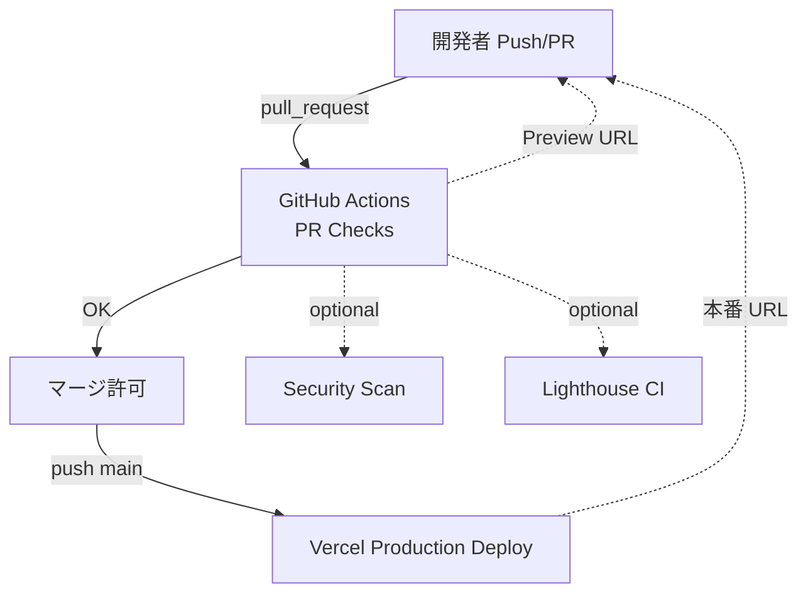

# Next.js × Vercel 無料 CI/CD ガイド

## 0. 目的
GitHub 上の Next.js プロジェクトを **無料プラン**のまま  
- PR 作成時に *AI コードレビュー* と *Lint/Test* を実行  
- `main` ブランチへのマージを保護  
- マージ成功時に Vercel Production へ自動デプロイ  
- （任意）セキュリティスキャン・UX 測定を追加  

というパイプラインで運用する設計指針をまとめます。  
前提知識ゼロでも **クリック操作 + YAML コピペ** だけで導入できます。

---

## 1. システム構成図



---

## 2. リポジトリ構造

```
your-repo/
├─ .github/
│  └─ workflows/
│     ├─ pr.yml   # AI レビュー + Lint/Test
│     └─ sec.yml  # (任意) セキュリティスキャン
└─ nextjs app...
```

---

## 3. YAML テンプレート

### 3.1 PR 用 (`.github/workflows/pr.yml`)

```yaml
name: PR Checks
on: [pull_request]

jobs:
  check:
    runs-on: ubuntu-latest
    permissions: write-all      # PR へコメントを書くため
    steps:
      - uses: actions/checkout@v4

      # Lint & Unit Test
      - uses: actions/setup-node@v4
        with: { node-version: 20 }
      - run: npm ci
      - run: npm run lint
      - run: npm test

      # AI Code Review (OpenAI)
      - uses: Ostrich-Cyber-Risk/ai-codereviewer@v2.7.1
        with:
          GITHUB_TOKEN: ${{ secrets.GITHUB_TOKEN }}
          OPENAI_API_KEY: ${{ secrets.OPENAI_API_KEY }}
```

### 3.2 セキュリティスキャン (`.github/workflows/sec.yml`) *任意*

```yaml
name: Security Scan
on:
  pull_request:
  push:
    branches: [main]

jobs:
  trivy:
    runs-on: ubuntu-latest
    steps:
      - uses: actions/checkout@v4
      - uses: aquasecurity/trivy-action@0.28.0
        with:
          scan-type: fs
          severity: CRITICAL,HIGH
          exit-code: 1
```

---

## 4. GitHub 設定手順

1. **Secrets 登録**  
   - `OPENAI_API_KEY`: OpenAI の API キー  
   - メニュー: *Settings → Secrets and variables → Actions*  
2. **Branch Protection**  
   - Settings → Branches → *Add rule* (`main`)  
   - ✓ Require status checks (`PR Checks`, `Security Scan`)  
   - ✓ Require pull request review  
   - （任意）Enable auto‑merge  
3. **Dependabot**  
   - *Settings → Security & analysis* で *Enable Dependabot alerts & security updates*  

---


### 4.2 Branch Protection 詳細オプション

| オプション | 推奨設定 | 解説 |
|------------|---------|------|
| **Required approvals** | `1` 以上 | ヒューマンレビューが 1 人は通るように。規模が小さい場合は 1 で十分。 |
| **Dismiss stale pull request approvals when new commits are pushed** | ☑ | 追加コミットでレビュー内容が古くなった場合に再承認を強制します。 |
| **Require review from Code Owners** | 任意 | `CODEOWNERS` ファイルを活用している場合のみチェック。 |
| **Require approval of the most recent reviewable push** | ☑ | レビュアーとプッシュした人が異なる場合に安全性が向上。 |
| **Require conversation resolution before merging** | ☑ | すべてのコメントスレッドが解決済みでないとマージ不可。 |
| **Request pull request review from Copilot** | 任意 | Copilot Code Review を契約している場合に自動リクエスト。 |
| **Allowed merge methods** | *Merge, Squash, Rebase* を必要に応じて | **Squash** だけに制限すると履歴がシンプル。リリース用タグ運用なら Merge も可。 |

> **Tips**  
> - 「Require branches to be up to date before merging」をオンにすると、PR 先が最新 `main` ベースになるまで CI を再実行させるため、テストの抜け漏れを防ぎます。  
> - 強制署名 (`Require signed commits`) や Linear history は組織ポリシーに応じて選択してください。


### 4.3 PR を介さない「緊急直 push」運用

> **要件**  
> - 通常は PR フローでレビュー & CI を通す。  
> - ただし緊急 hot‑fix などで **PR を作成せず直接 `main` に push** できるようにしておく。  
> - PR を立てた場合は従来どおり *Status Checks がすべて緑* にならないとマージできない。

| 設定項目 | 推奨状態 | 補足 |
|----------|---------|------|
| **Require a pull request before merging** | **オフ** | 直 push を許可するため無効化。 |
| **Require status checks to pass** | ☑ | プッシュ後でも CI が回り、テストが赤ならブランチが「Failing」になる。<br>（コミットは残るが、Slack 通知などで気付けるようにしておく） |
| **Include administrators** | 任意 | 管理者以外には直 push させたくない場合は **オン** にしておく。 |
| **Restrict who can push to matching branch** | 任意 | 緊急対応を行えるメンバーだけに限定可能。 |

#### 運用フロー

```
(通常)                (緊急)
Feature push          Hot-fix push
     │                     │
 PR 作成               main 直 push
     │                     │
PR Checks 🟢         GitHub Actions 🚀
     │                     │
Merge → main         (CI が失敗したら即座に追加コミットで修正)
```

> **注意**  
> 直 push で CI が失敗すると Production へも不安定コードが展開される恐れがあります。  
> - Vercel の *Protected Branches* を利用し、Production デプロイ対象を `release` ブランチに切り替える  
> - `main` は Preview only、`release` だけ Production という運用も一案です。


## 5. Vercel 側設定

1. **GitHub リポジトリを Import**  
   - Vercel ダッシュボード → *Add New → Project* で対象リポジトリを選択  
2. **Environment Variables**  
   - *Project Settings → Environment Variables* で `NEXT_PUBLIC_...` 等を登録  
3. **Production Branch**  
   - デフォルト `main`。マージされると自動で Production デプロイ  
4. **Preview Deployments**  
   - PR ごとに一意の URL が発行される（UX・QA に活用）

---

## 6. 無料枠一覧

| サービス | 無料枠 | 主な注意点 |
|----------|--------|-----------|
| GitHub Actions | 2,000 分/月 (private) | 超過すると実行停止。Billing で Spending limit = 0 に |
| Vercel Hobby | 帯域 1 TB/月・100 デプロイ/日 | 1 メンバーまで |
| OpenAI API | 新規は無料クレジット | GPT-4o 利用時はコスト注意 |
| Trivy Action | OSS | 実行は Actions 分を消費 |
| Lighthouse CI | OSS | Mobile+Desktop 両方だと実行時間倍 |

---

## 7. 拡張アイデア

| 目的 | 追加アクション | 備考 |
|------|---------------|------|
| UX 劣化防止 | `treosh/lighthouse-ci-action` | Core Web Vitals しきい値超で失敗 |
| コンテナ脆弱性 | `trivy-action` + `scan-type: image` | docker build push 前に実行 |
| 高度な AI レビュー | GitHub Copilot Code Review | Enterprise/Pro+ 有料 |

---

## 8. デプロイの流れ

1. **開発者**  
   - `git checkout -b feature/foo`  
   - コードを書き `git push -u origin feature/foo`  
2. **GitHub**  
   - PR 作成 → `PR Checks` ワークフロー開始  
   - Lint/Test → AI Review 結果が PR にコメント  
3. **レビュアー**  
   - 指摘を反映し、PR が緑になれば *Merge*  
4. **main ブランチ**  
   - `Security Scan` 実行（オプション）  
   - 成功で自動マージ → Vercel Production 更新  
5. **本番確認**  
   - https://your-app.vercel.app で動作確認

---

## 9. トラブルシューティング

| 症状 | チェックポイント |
|------|-----------------|
| ワークフローが動かない | `.github/workflows/*.yml` のパスと拡張子確認 |
| PR に AI コメントが付かない | `OPENAI_API_KEY` シークレット漏れ |
| main マージできない | Branch Protection の必要チェックが失敗していないか |
| Vercel デプロイ失敗 | ビルドログで環境変数不足を確認 |

---

*Happy CI/CD!* :rocket:
